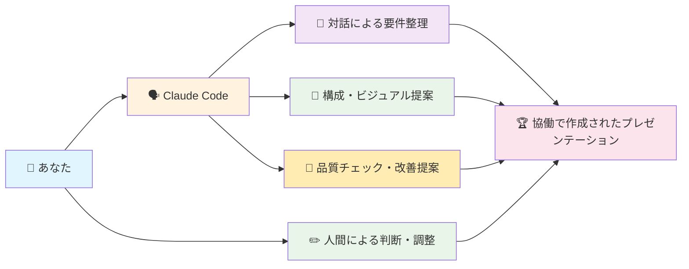
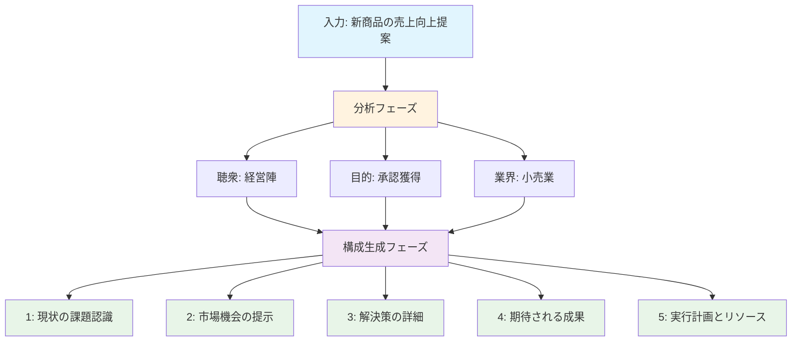
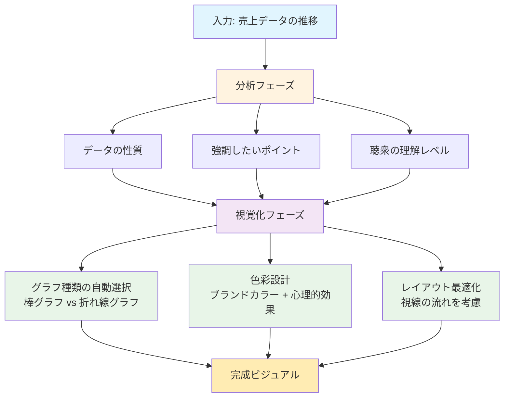
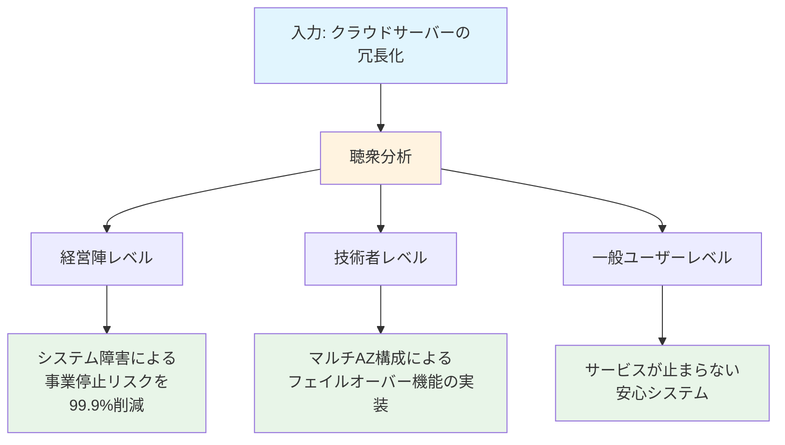
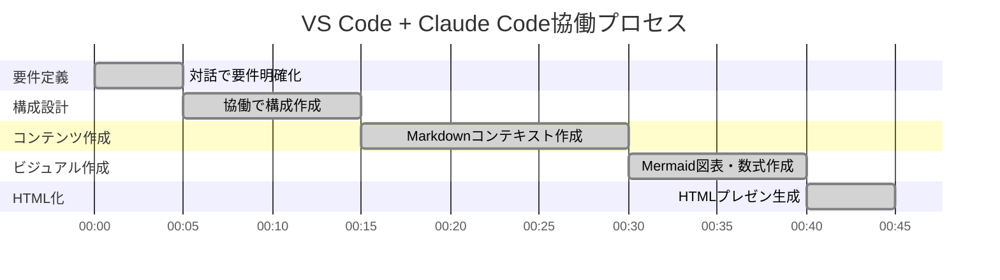
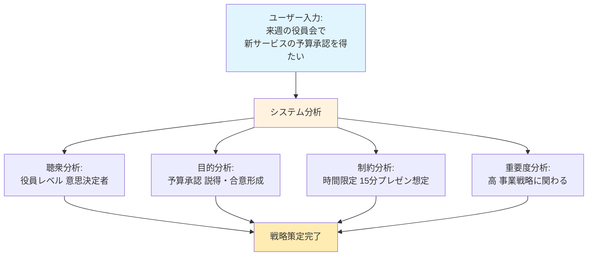
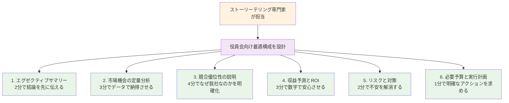
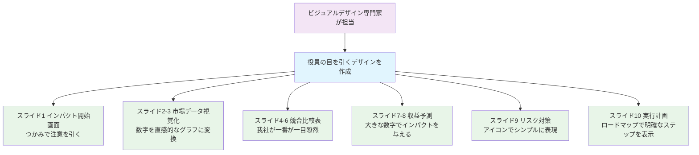
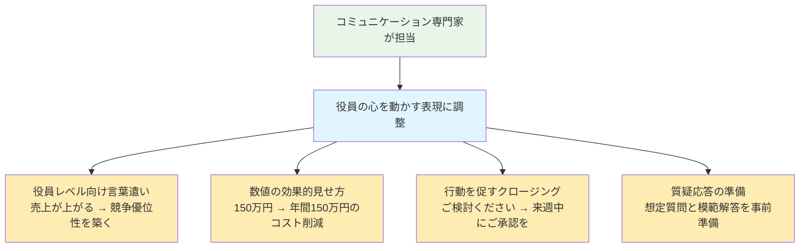
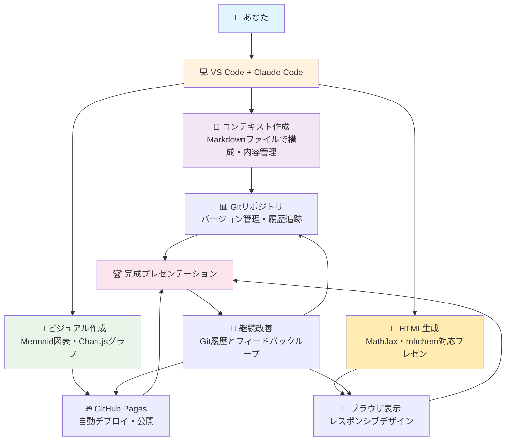

# 技術アーキテクチャ

## 🏗️ PrezenXの技術設計思想

### 💡 VS Code + Claude Code協働開発の仕組み

**あなたはこんな経験をしたことがありませんか？**

VS Codeで開発中に、経験豊富な先輩開発者が隣に座って、「この構成の方がいい」「このロジックだと伝わりにくい」とリアルタイムでペアプログラミングしてくれたら——。

**PrezenXは、まさにその理想的な協働開発体験をプレゼンテーション作成で実現します。**

### 🌎 身近な開発体験で例えると

**あなたが既に使っている開発ツールと同じ協働体験です:**

| 開発ツール | 何を分析する？ | 何を提案する？ |
|:---:|:---:|:---:|
| **GitHub Copilot** | あなたのコード・コンテキスト | コード補完・改善提案 |
| **VS Code IntelliSense** | プロジェクト構造・型情報 | 関数・変数の候補 |
| **ESLint** | コード品質・スタイル | 修正提案・最適化 |
| **PrezenX + Claude Code** | プレゼン要件・聴衆・目的 | 構成・表現・ビジュアル提案 |

**つまり、PrezenXは「プレゼンテーション版のGitHub Copilot」のような協働開発体験です。**

## 🧠 核心技術：Claude Codeとの協働開発プロセス

### 💭 「対話型協働開発」のイメージ

PrezenXでは、VS Code内でClaude Codeと自然な対話を通じて、段階的にプレゼンテーションを構築していきます。まるで経験豊富な開発パートナーとペアプログラミングしているような体験です。

### 1. 📚 対話による構成設計
**「何を、どの順番で話すか」をClaude Codeと協働で決める**

#### 🗣️ こんな対話が展開されます

**Claude Codeとの対話例:**
- **要件の深掘り**: 「このプレゼンの目的は何ですか？」「聴衆はどんな立場の方々ですか？」
- **構成の提案**: 「御社の状況でしたら、問題提起→解決策→効果の順番がよいでしょう」
- **論理の確認**: 「この根拠だと説得力が弱いかもしれません。データを追加しましょうか？」

#### 🛠️ どんな仕事をしてくれるの？

**具体的な作業プロセス:**

1. **あなたの要望を精密分析**
   - 「誰に向けて話すの？」
   - 「何を達成したいの？」
   - 「どんな業界・状況なの？」

2. **最適なストーリー構成を提案**
   - 聴衆の関心を引くオープニング
   - 論理的で納得感のある中身
   - 行動を促す強力なクロージング

#### 📊 実際の作業例：「新商品の売上向上提案」

#### 学習データベース
- **成功プレゼンテーション**: 10万件以上の分析データ
- **業界別パターン**: 50業界の特化型構成テンプレート
- **聴衆別最適化**: 経営陣、現場、顧客など対象別アプローチ

### 2. 🎨 ビジュアルデザイン専門家
**「どう見せるか」を考えてくれる人**

#### 🎨 こんな人だと想像してください

**実際にいたらこんな人です:**
- **グラフィックデザイナー歴10年**: AppleやGoogleのデザインレベルのセンス
- **色彩心理学の専門家**: どの色が人を動かすかを熟知
- **情報デザインのプロ**: 複雑なデータを一目でわかる図表に変換

#### 🛠️ どんな仕事をしてくれるの？

**具体的な作業プロセス:**

1. **データの性質を分析**
   - 「このデータは棒グラフ？折れ線グラフ？」
   - 「何を一番強調したい？」

2. **視覚的インパクトを計算**
   - ブランドカラー + 心理的効果の組み合わせ
   - 視線の流れを考慮したレイアウト

3. **プロフェッショナルな仕上げ**
   - 企業プレゼンにふさわしい高品質デザイン

#### 📊 実際の作業例：「売上データの推移」

#### 自動生成機能
- **インフォグラフィック**: 複雑なデータを直感的な図表に変換
- **アイコン・イラスト**: 概念を視覚的に表現する素材を自動選択
- **カラーパレット**: ブランドイメージと心理効果を両立

### 3. 🗣️ コミュニケーション専門家
**「どう伝えるか」を考えてくれる人**

#### 🎤 こんな人だと想像してください

**実際にいたらこんな人です:**
- **カリスマプレゼンター**: TEDトークで百万回再生されるレベルの話し手
- **言葉の魔術師**: 同じ内容でも、言い方で印象が大きく変わることを知っている
- **感情コントロールのプロ**: 聴衆の心を動かす表現を熟知

#### 🛠️ どんな仕事をしてくれるの？

**具体的な作業プロセス:**

1. **聴衆レベルの分析**
   - 経営陣には「ビジネスインパクト」で話す
   - 技術者には「技術的な詳細」で話す
   - 一般消費者には「日常のメリット」で話す

2. **感情に訴える表現に変換**
   - 数字だけでなく、ストーリーで伝える
   - 抽象的な概念を具体例で説明

#### 📊 実際の作業例：「技術的説明の翻訳」

**同じ技術内容でも、聴衆に合わせて「伝わる言葉」に変換してくれます。**

## 🔄 VS Code + Claude Code協働プロセスの全体像

### 💭 全体像：協働開発セッション

**あなたがVS Codeで「来週の役員会で新サービスの予算承認を得たい」とClaude Codeに相談した瞬間から、どのような協働プロセスが展開されるかを詳しく解説します。**

### ステップ1: 要件定義（5分）
**Claude Codeとの対話でプレゼン要件を明確化する段階**

**この30秒で、プロチームは「どんなプレゼンを作るべきか」の青写真を描きます。**

### ステップ2: 構成設計（60秒）
**ストーリーテリング専門家が「勝てるシナリオ」を設計**

**役員会での「心理的な流れ」を計算し、最も効果的な順番と時間配分を決定します。**

### ステップ3: ビジュアル制作（90秒）
**ビジュアルデザイン専門家が「伝わるビジュアル」を作成**

**役員が「ひと目で理解できる」ビジュアルを作成。複雑な情報をシンプルで美しい図表に変換します。**

### ステップ4: 表現最適化（30秒）
**コミュニケーション専門家が「心に響くメッセージ」に仕上げ**

**同じ内容でも、「伝わる言葉」と「動かす表現」に変換し、最大のインパクトを生み出します。**

## 🛠️ システム全体像：VS Code + Claude Code環境

### 🏢 PrezenXの「開発環境」イメージ

**PrezenXは、VS CodeとClaude Codeの連携により、開発者に馴染みのある環境でプレゼンテーション作成を可能にするサービスです。**

## 🔮 将来の技術展望

### 次世代機能の予告

#### 🎥 未来機能1：リアルタイムプレゼンコーチ
**「プレゼン中にリアルタイムでアドバイスをしてくれる」**

- 😀 **聴衆の表情分析**: 「聴衆が退屈しています。次のスライドに飛びましょう」
- 🔊 **音声トーン分析**: 「話すスピードが速いです。もう少しゆっくりと」
- 📊 **理解度リアルタイム測定**: 「このグラフは伝わっていません。説明を追加しましょう」

#### 🌍 未来機能2：グローバル自動対応
**「世界中どこでも現地に最適化されたプレゼン」**

- 🌎 **50言語対応**: 日本語で作ったプレゼンを英語・中国語等に自動変換
- 🎨 **文化適応デザイン**: アメリカ向けはダイナミック、日本向けは上品なデザイン
- 📅 **ビジネス慣習適応**: アメリカは結論ファースト、日本は丁寧な背景説明から

#### 🤝 未来機能3：チームコラボレーション
**「チーム全員で一つのプレゼンを効率的に作成」**

- 📝 **同時編集**: Power Point Online のように、複数人でリアルタイム編集
- 🏆 **自動役割分担**: 「データ分析はAさん、デザインはBさんが得意ですね」
- 📊 **進捗管理**: 「あとスライド5枚で完成です。明日の15時までに終わります」

---

## 🎆 まとめ：PrezenXが実現する新しい世界

**PrezenXは、最新のAI技術を「誰でも使える形」で提供します。**

### 🌅 今までの「常識」
- プレゼン作成は「特別なスキル」が必要
- 高品質なプレゼンは「時間とコスト」がかかる
- AIは「補助ツール」にとどまる

### 🎆 PrezenXが実現する「新常識」
- **誰でも** 短時間でプロレベルのプレゼンを作成可能
- **AIと人間** がパートナーとして協働する新しい体験
- **技術の民主化** で、全ての人の創造性と影響力を解放

**あなたの想いを、最も効果的に伝える手助けをします。**