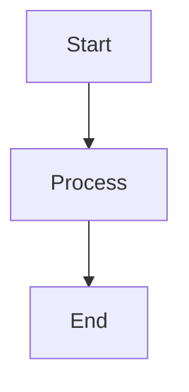

# 環境構築ガイド

## 🚀 PrezenX開発環境のセットアップ

### 💡 このガイドについて

**PrezenXは、VS Code + Claude Code + WSL環境での協働開発を前提として設計されています。**

このガイドでは、Windows環境でWSL（Windows Subsystem for Linux）を使用して、PrezenXの開発環境を構築する手順を詳しく説明します。

### 🎯 セットアップ完了後にできること

- VS Code内でClaude Codeとの自然な対話
- Markdownでのプレゼンテーションコンテキスト作成
- Mermaid図表・数式・グラフの協働作成
- HTMLプレゼンテーションの自動生成
- GitHubでのバージョン管理・公開

---

## 📋 必要な前提条件

### ✅ ハードウェア要件

| 項目 | 最小要件 | 推奨要件 |
|:---:|:---:|:---:|
| **OS** | Windows 10 ver.2004以降 | Windows 11 |
| **CPU** | Intel Core i5 / AMD Ryzen 5 | Intel Core i7 / AMD Ryzen 7 |
| **メモリ** | 8GB | 16GB以上 |
| **ストレージ** | 10GB空き容量 | 20GB以上 |
| **ネットワーク** | 常時インターネット接続 | 高速回線推奨 |

### ✅ ソフトウェア要件

**必須コンポーネント:**
- Windows 10/11（WSL2対応版）
- 管理者権限でのインストール権限
- GitHub アカウント
- **claude.ai アカウント（Pro版またはMax版サブスクリプション必須）**

---

## 🔧 Step 1: WSL2のセットアップ

### 1.1 WSL2の有効化

**PowerShellを管理者権限で実行し、以下のコマンドを実行:**

```powershell
# WSL機能を有効化
dism.exe /online /enable-feature /featurename:Microsoft-Windows-Subsystem-Linux /all /norestart

# 仮想マシンプラットフォーム機能を有効化
dism.exe /online /enable-feature /featurename:VirtualMachinePlatform /all /norestart

# システムを再起動
Restart-Computer
```

### 1.2 WSL2をデフォルトバージョンに設定

**再起動後、PowerShellで以下を実行:**

```powershell
# WSL2をデフォルトバージョンに設定
wsl --set-default-version 2
```

### 1.3 Ubuntu 22.04 LTSのインストール

**Microsoft Storeから「Ubuntu 22.04.3 LTS」をインストール:**

1. Microsoft Storeを開く
2. 「Ubuntu 22.04.3 LTS」を検索
3. 「インストール」をクリック
4. インストール完了後、起動してユーザー設定を完了

**初回セットアップ:**
```bash
# ユーザー名とパスワードを設定
# （例：username: developer, password: 任意の安全なパスワード）

# パッケージリストを更新
sudo apt update && sudo apt upgrade -y
```

### 1.4 WSL2の動作確認

```powershell
# WSLの状態確認
wsl --list --verbose

# 結果例：
#   NAME            STATE           VERSION
# * Ubuntu-22.04    Running         2
```

---

## 💻 Step 2: VS Codeのセットアップ

### 2.1 VS Codeのインストール

#### 🖥️ Windowsホスト側へのインストール

**公式サイトからダウンロード・インストール:**
1. https://code.visualstudio.com/ にアクセス
2. 「Download for Windows」をクリック
3. ダウンロードしたファイルを実行してインストール

**重要ポイント:**
- VS Codeは**Windowsホスト側**にインストールします
- WSL内に直接インストールする必要はありません
- VS CodeのRemote-WSL拡張機能でWSL環境に接続して作業します

#### 🔗 WSL環境との接続確認

**インストール後の接続テスト:**
```bash
# WSL環境内で以下を実行
cd ~
mkdir test-vscode
cd test-vscode
code .
```

**正常な場合の動作:**
- WindowsのVS Codeが起動
- 画面左下に「WSL: Ubuntu-22.04」と表示
- WSL環境のファイルシステムが認識される

**接続に失敗する場合:**
```bash
# WSL環境でPATHを確認
echo $PATH

# VS Codeがインストールされているか確認
which code

# もしcodeコマンドが見つからない場合
# Windowsで VS Code を再インストールし、「Add to PATH」オプションを有効化
```

### 2.2 必須拡張機能のインストール

**VS Codeを起動し、以下の拡張機能をインストール:**

#### 🔧 PrezenX必須拡張機能

```
# 必須拡張機能リスト（正確な拡張機能ID）
1. WSL (ms-vscode-remote.remote-wsl)
2. Claude Code for VSCode (claude-ai.claude-code)
3. Markdown All in One (yzhang.markdown-all-in-one)
4. Markdown Preview Mermaid Support (bierner.markdown-mermaid)
5. Live Preview (ms-vscode.live-server)
6. Git Graph (mhutchie.git-graph)
```

#### 📝 拡張機能のインストール手順

**方法1: VS Code拡張機能画面から（推奨）**
1. VS Code左サイドバーの拡張機能アイコン（四角が4つのアイコン）をクリック
2. 検索ボックスに拡張機能IDを入力（例：`claude-ai.claude-code`）
3. 「Install」をクリック
4. インストール完了後、必要に応じて「Reload」をクリック

**方法2: コマンドラインから一括インストール**
```bash
# WSL環境から実行（推奨）
# ※VS CodeがWSL環境に接続している状態で実行

# 必須拡張機能を一括インストール
code --install-extension ms-vscode-remote.remote-wsl
code --install-extension claude-ai.claude-code
code --install-extension yzhang.markdown-all-in-one
code --install-extension bierner.markdown-mermaid
code --install-extension ms-vscode.live-server
code --install-extension mhutchie.git-graph
```

#### 🚨 WSL環境での拡張機能インストール時の注意点

**重要:**
- WSL拡張機能は**Windowsホスト側**にインストール
- その他の拡張機能は**WSL環境側**にインストール
- VS Codeの拡張機能タブで「Local」と「WSL: Ubuntu」を確認

**正しいインストール場所:**
```
📦 Windowsホスト側（Local）
├── WSL (ms-vscode-remote.remote-wsl)

📦 WSL環境側（WSL: Ubuntu）
├── Claude Code for VSCode
├── Markdown All in One
├── Markdown Preview Mermaid Support
├── Live Preview
└── Git Graph
```

**確認方法:**
1. VS Codeで Ctrl+Shift+X で拡張機能を開く
2. 「LOCAL - INSTALLED」と「WSL: UBUNTU - INSTALLED」の両方を確認
3. WSL環境に接続時、適切な場所に拡張機能がインストールされているか確認

#### 🎯 各拡張機能の役割

| 拡張機能 | 役割 | PrezenXでの用途 |
|:---:|:---:|:---:|
| **WSL** | WSL環境との連携 | Linux環境でのVS Code実行 |
| **Claude Code for VSCode** | Claude Code統合 | AI協働開発の中核機能 |
| **Markdown Preview Mermaid Support** | Mermaid図表プレビュー | 図表のリアルタイム確認 |
| **Live Preview** | HTMLライブプレビュー | プレゼンテーションの即座確認 |
| **Git Graph** | Git履歴視覚化 | バージョン管理の可視化 |

#### ⚠️ 重要な注意事項

**Claude Code for VSCode について:**
```
⚠️ Claude Code for VSCode拡張機能は、claude.ai Pro/Max契約者のみ利用可能
⚠️ インストール後、claude.aiアカウントでの認証が必要
⚠️ 拡張機能IDは変更される可能性があります（最新情報は公式サイト確認）
```

### 2.3 WSL環境への接続とワークスペース設定

#### 🔌 VS CodeからWSL環境への接続

**基本的な接続方法:**

```bash
# WSL環境で作業ディレクトリを作成
mkdir -p ~/prezentx-workspace
cd ~/prezentx-workspace

# VS Codeで開く
code .
```

**接続確認ポイント:**
- VS Code左下に「WSL: Ubuntu-22.04」が表示される
- ターミナルがLinux環境になっている
- 拡張機能がWSL環境で動作している

#### 🛠️ 接続トラブルシューティング

**問題1: `code` コマンドが見つからない**
```bash
# 解決策: Windowsの環境変数PATHを確認
# Windows PowerShellで実行：
$env:PATH -split ';' | Select-String "Microsoft VS Code"

# VS Codeが見つからない場合、再インストール時に
# 「Add to PATH」オプションを必ずチェック
```

**問題2: WSL拡張機能がインストールされていない**
```bash
# 解決策: WSL拡張機能を手動インストール
# VS CodeのExtensions（Ctrl+Shift+X）で
# "ms-vscode-remote.remote-wsl" を検索してインストール
```

**問題3: 拡張機能がWSL環境で動作しない**
```bash
# 解決策: WSL環境に再インストール
# WSL環境に接続した状態で拡張機能を再インストール
code --install-extension claude-ai.claude-code --force
```

#### 💡 推奨ワークスペース設定

**PrezenX専用ワークスペースの作成:**
```bash
# WSL環境での推奨ディレクトリ構造
mkdir -p ~/prezentx-workspace/{projects,templates,resources}

# プロジェクト用ディレクトリ
cd ~/prezentx-workspace/projects

# PrezenXプロジェクトをクローン（例）
git clone https://github.com/your-username/your-presentation.git

# VS Codeでワークスペースを開く
cd ~/prezentx-workspace
code .
```

**VS Code設定ファイル（.vscode/settings.json）:**
```json
{
    "files.defaultLanguage": "markdown",
    "markdown.preview.breaks": true,
    "markdown.preview.typographer": true,
    "terminal.integrated.defaultProfile.linux": "bash",
    "git.enableSmartCommit": true,
    "git.confirmSync": false
}
```

#### 🎯 コマンドパレットでの接続（代替方法）

**手動でWSL環境に接続:**
1. `Ctrl + Shift + P` でコマンドパレットを開く
2. 「WSL: Connect to WSL」を選択
3. WSL環境でVS Codeが起動することを確認

---

## 🌐 Step 3: Node.js開発環境のセットアップ

### 3.1 Node.jsのインストール（WSL内）

**WSL Ubuntu環境で以下を実行:**

```bash
# Node.js LTS版のインストール（NodeSource公式リポジトリ使用）
curl -fsSL https://deb.nodesource.com/setup_lts.x | sudo -E bash -
sudo apt update
sudo apt install nodejs -y

# インストール確認
node --version
npm --version
```

**参考: Node Version Manager (nvm) について**

nvmは複数のNode.jsバージョンを管理したい場合に便利ですが、PrezenXでは単一のLTS版で十分です。上記の公式リポジトリからのインストールを推奨します。

### 3.2 必要なパッケージのグローバルインストール

```bash
# Markdownの処理とHTMLジェネレーターに必要なパッケージ
npm install -g @mermaid-js/mermaid-cli
npm install -g live-server
npm install -g markdown-it
npm install -g http-server

# インストール確認
mmdc --version
live-server --version
```

---

## 🔐 Step 4: Git・GitHubのセットアップ

### 4.1 Gitの設定（WSL内）

```bash
# Gitの基本設定
git config --global user.name "Your Name"
git config --global user.email "your.email@example.com"

# エディターの設定
git config --global core.editor "code --wait"

# 設定確認
git config --list
```

### 4.2 GitHub CLIのインストール

```bash
# GitHub CLI (gh) のインストール（公式リポジトリ使用）
type -p curl >/dev/null || sudo apt install curl -y
curl -fsSL https://cli.github.com/packages/githubcli-archive-keyring.gpg | sudo dd of=/usr/share/keyrings/githubcli-archive-keyring.gpg \
&& sudo chmod go+r /usr/share/keyrings/githubcli-archive-keyring.gpg \
&& echo "deb [arch=$(dpkg --print-architecture) signed-by=/usr/share/keyrings/githubcli-archive-keyring.gpg] https://cli.github.com/packages stable main" | sudo tee /etc/apt/sources.list.d/github-cli.list > /dev/null \
&& sudo apt update \
&& sudo apt install gh -y

# GitHub認証
gh auth login
# ブラウザでの認証を選択し、GitHubアカウントでログイン
```

### 4.3 SSH認証の設定（推奨）

```bash
# SSH鍵の生成
ssh-keygen -t ed25519 -C "your.email@example.com"
# Enter連打でデフォルト設定を使用

# SSH Agentの開始
eval "$(ssh-agent -s)"
ssh-add ~/.ssh/id_ed25519

# 公開鍵をGitHubに追加
cat ~/.ssh/id_ed25519.pub
# 表示された内容をコピーし、GitHub > Settings > SSH and GPG keys > New SSH key に追加
```

---

## 🤖 Step 5: Claude Codeのセットアップ

### 5.1 システム要件の確認

**Claude Code動作要件:**
- ✅ Node.js 18+ (Step 3で既にインストール済み)
- ✅ WSL環境 (Step 1で既にセットアップ済み)
- ✅ 最小4GBメモリ
- ✅ インターネット接続

### 5.2 Claude CLIのインストール

**WSL Ubuntu環境で以下を実行:**

```bash
# Claude Code CLIをグローバルインストール
npm install -g @anthropic-ai/claude-code

# インストール確認
claude --version
```

**⚠️ 重要な注意事項:**
```
- sudo npm install -g は使用しないでください
- Node.js 18+が必要です（Step 3でインストール済み）
- WSL環境での実行が必須です
```

### 5.3 Claude Codeの認証設定

**認証方法の選択:**

#### 方法1: Anthropic Console認証（推奨）
```bash
# Claude Codeを起動
claude

# 初回起動時、認証方法を選択
# "Anthropic Console" を選択してブラウザで認証
```

#### 方法2: Claude App認証（Pro/Max契約者）
```bash
claude

# 認証方法で "Claude App" を選択
# claude.ai Pro/Max アカウントで認証
```

### 5.4 プロジェクトでのClaude Code初期化

**プロジェクトディレクトリで初期化:**

```bash
# プロジェクトディレクトリに移動
cd ~/prezenx-projects

# Claude Codeを起動
claude

# 初回セットアップコマンド（推奨）
/init

# ターミナル設定の最適化
/terminal-setup
```

### 5.5 VS Code拡張機能との連携

**VS Code内でClaude Codeを使用:**

1. VS CodeでWSL環境に接続
2. `Ctrl + Shift + P` でコマンドパレットを開く
3. "Claude Code: Start Session" を検索・実行
4. 認証済みのClaude Codeセッションが開始

**VS Code統合の確認:**
```bash
# VS Code内のターミナルでClaude Codeが利用できることを確認
claude --help
```

### 5.6 動作確認テスト

**基本的な動作確認:**

```bash
# Claude Codeセッションを開始
claude

# 基本的なテストコマンド
Hello, can you help me create a simple markdown file?

# プロジェクトガイド生成テスト
/init

# ヘルプ表示
/help
```

**成功した場合の表示例:**
```
Claude Code v1.x.x
Connected to Claude (Pro/Max)
Ready to collaborate on your project!
```

### 5.7 トラブルシューティング

#### 問題1: npm install でエラーが発生
```bash
# Node.jsバージョン確認
node --version  # 18.x.x以上であることを確認

# npmキャッシュクリア
npm cache clean --force

# 再インストール
npm install -g @anthropic-ai/claude-code
```

#### 問題2: 認証に失敗する
```bash
# 認証設定をリセット
claude --reset-auth

# 再度認証を実行
claude
```

#### 問題3: VS Code統合が動作しない
```
1. VS CodeでWSL環境に接続していることを確認
2. Claude Code拡張機能がインストールされていることを確認
3. ターミナルでclaudeコマンドが実行できることを確認
```

**重要な注意事項:**
```
⚠️ Claude Codeは対応国でのみ利用可能です
⚠️ Pro/Max契約者はClaude App認証を、それ以外はAnthropic Console認証を使用
⚠️ 常時インターネット接続が必要です
⚠️ 最新の利用条件は https://docs.anthropic.com/en/docs/claude-code で確認してください
```

---

## ✅ Step 6: 動作確認とテスト

### 6.1 基本環境の動作確認

```bash
# Node.js環境確認
node --version  # v18.x.x以上
npm --version   # 9.x.x以上

# Git設定確認
git config --get user.name
git config --get user.email

# GitHub CLI確認
gh auth status

# Mermaid CLI確認
mmdc --version
```

### 6.2 VS Code + WSL連携の確認

**VS Code（WSL環境）で以下を実行:**
1. VS Codeを開く
2. `Ctrl + Shift + P` → 「WSL: Connect to WSL」
3. 左下に「WSL: Ubuntu-22.04」が表示されることを確認
4. ターミナルを開いて `pwd` を実行、Linuxパスが表示されることを確認

### 6.3 Markdownプレビューの確認

**テスト用Markdownファイルの作成:**

```bash
# テスト用プレゼンテーションを作成
mkdir -p presentations/test
cat > presentations/test/sample.md << 'EOF'
# PrezenX テストプレゼンテーション

## Mermaidテスト

```mermaid
graph LR
    A[Claude Code] --> B[協働開発]
    B --> C[高品質プレゼン]


## 数式テスト
$$E = mc^2$$

## 化学式テスト
$$\ce{H2O}$$


## 終了
このテストが正常に表示されれば環境構築完了です。

EOF
```

**VS Codeでプレビュー確認:**
1. VS Codeで `presentations/test/sample.md` を開く
2. `Ctrl + Shift + V` でプレビューを表示
3. Mermaid図表、数式、化学式が正しく表示されることを確認

### 6.4 Microsoft Edge Markdown Viewer拡張機能のセットアップ

**PrezenXで生成されたHTMLファイルをブラウザで確認するため、Edge拡張機能をセットアップします。**

#### 6.4.1 Markdown Viewer拡張機能のインストール

**Microsoft Edge拡張機能のインストール手順:**

1. **Microsoft Edgeを開く**
2. **Edge拡張機能ストアにアクセス**
   - アドレスバーに `edge://extensions/` と入力
   - または 「設定など (...)」→「拡張機能」をクリック

3. **Microsoft Edge Add-onsストアを開く**
   - 左下の「Microsoft Edge Add-onsストアを開く」をクリック

4. **Markdown Viewerを検索・インストール**
   - 検索ボックスに「Markdown Viewer」と入力
   - 「Markdown Viewer」（作者: simov）を選択
   - 「インストール」をクリック
   - 「拡張機能の追加」で確認

#### 6.4.2 拡張機能の設定

**ローカルファイルアクセスの有効化:**

1. **拡張機能管理画面にアクセス**
   - `edge://extensions/` に移動

2. **Markdown Viewer拡張機能の設定**
   - 「Markdown Viewer」の「詳細」をクリック
   - 「ファイル URL へのアクセスを許可する」をONに設定

3. **拡張機能の動作確認**
   - Edgeで `.md` ファイルを直接開く
   - Markdownが美しくレンダリングされることを確認

#### 6.4.3 PrezenX用の設定最適化

**推奨設定:**

1. **Markdown Viewer設定画面にアクセス**
   - 拡張機能アイコンをクリック
   - 「Options」または「設定」を選択

2. **推奨設定項目:**
   ```
   ✅ Enable MathJax (数式表示)
   ✅ Enable Mermaid (図表表示)  
   ✅ Enable syntax highlighting (コードハイライト)
   ✅ Enable table support (表サポート)
   ```

#### 6.4.4 動作確認テスト

**Markdown Viewer動作テスト:**

```bash
# テスト用HTMLファイルの作成
cat > ~/test-markdown.md << 'EOF'
# PrezenX Markdown Viewer テスト

## Mermaidテスト


## 数式テスト
$$E = mc^2$$

## 表テスト
| 項目 | 値 |
|:---:|:---:|
| テスト1 | OK |
| テスト2 | OK |

これが正しく表示されればセットアップ完了です。
EOF

# Edgeでファイルを開く
explorer.exe ~/test-markdown.md
```

**期待される結果:**
- Edgeブラウザが起動
- Markdownが美しくレンダリング
- Mermaid図表、数式、表が正しく表示

#### 6.4.5 代替ブラウザでの設定

**Google Chrome を使用する場合:**

1. **Chrome Web Store** にアクセス
2. 「Markdown Viewer」（作者: simov）をインストール
3. 同様にファイルURLアクセスを有効化

**Firefox を使用する場合:**

1. **Firefox Add-ons** で「Markdown Viewer Webext」を検索
2. インストール後、同様の設定を実施

#### ⚠️ 重要な注意事項

```
⚠️ ローカルファイルアクセス権限は、信頼できる拡張機能にのみ付与してください
⚠️ PrezenXで生成されるHTMLファイルの多くはこの拡張機能で美しく表示されます
⚠️ 一部の高度なインタラクティブ機能は専用のHTMLビューアーが必要な場合があります
```

---

## 🎉 セットアップ完了の確認

### ✅ 完了チェックリスト

**以下がすべて完了していることを確認してください:**

- [ ] WSL2が正常に動作している
- [ ] VS CodeでWSL環境に接続できる
- [ ] Node.js（LTS版）がインストールされている
- [ ] Git設定が完了している
- [ ] GitHub CLIで認証が完了している
- [ ] 必要なVS Code拡張機能がインストールされている
- [ ] Mermaid CLIが動作する
- [ ] Markdownプレビューで図表・数式が表示される
- [ ] claude.ai Pro版またはMax版サブスクリプションが有効

### 🚀 次のステップ

**環境構築が完了したら、以下のドキュメントに進んでください:**
- `06-basic-workflow.md` - 基本的な協働開発ワークフロー
- `07-presentation-creation.md` - プレゼンテーション作成の実践

---

## 🔧 トラブルシューティング

### よくある問題と解決方法

#### 問題1: WSL2の起動に失敗する

```
症状: "WSL 2 is not supported" エラー
解決方法:
1. Windows Updateを最新版に更新
2. BIOS設定で仮想化機能（Intel VT-x/AMD-V）を有効化
3. PowerShellで以下を実行:
   Enable-WindowsOptionalFeature -Online -FeatureName VirtualMachinePlatform
```

#### 問題2: Node.jsのインストールに失敗する

```
症状: Node.jsのインストールでエラー
解決方法:
1. ネットワーク接続を確認
2. 基本的なインストール方法を再試行:
   curl -fsSL https://deb.nodesource.com/setup_lts.x | sudo -E bash -
   sudo apt update
   sudo apt install nodejs -y

3. システムのパッケージキャッシュをクリア:
   sudo apt clean
   sudo apt autoclean
   sudo apt autoremove
```

#### 問題3: VS CodeがWSLに接続できない

```
症状: "WSL: Connect to WSL" が失敗する
解決方法:
1. WSL拡張機能を再インストール
2. VS Codeを完全に終了して再起動
3. PowerShellで: wsl --shutdown → wsl
```

#### 問題4: Mermaid図表が表示されない

```
症状: プレビューでMermaid図表が表示されない
解決方法:
1. Mermaid関連の拡張機能を確認・再インストール
2. @mermaid-js/mermaid CLIの再インストール:
   npm uninstall -g @mermaid-js/mermaid-cli
   npm install -g @mermaid-js/mermaid-cli
```

#### 問題5: GitHub認証でエラーが発生する

```
症状: gh auth login でエラー
解決方法:
1. ブラウザでGitHubにログインできることを確認
2. 以下を試行:
   gh auth logout
   gh auth login --web
```

### 🆘 サポート情報

**さらなる支援が必要な場合:**
1. 各ツールの公式ドキュメントを参照
2. GitHub Issues でコミュニティに質問
3. Stack Overflow で技術的な問題を検索

---

**環境構築の完了により、VS Code + Claude Code協働開発でのプレゼンテーション作成が可能になります。次のステップで実際の開発ワークフローを習得しましょう。**

---

## 📋 ナビゲーション

| 前のページ | 目次 | 次のページ |
|:---:|:---:|:---:|
| [✨ 機能仕様](04-features-specifications.md) | [🏠 ホーム](README.md) | [📋 実装方法論](06-implementation-methodology.md) |

### 📚 全ドキュメント一覧
1. [📊 エグゼクティブサマリー](01-executive-summary.md)
2. [🎯 背景と課題](02-background-challenges.md)
3. [🏗️ 技術アーキテクチャ](03-technical-architecture.md)
4. [✨ 機能仕様](04-features-specifications.md)
5. **[🛠️ 環境構築](05-environment-setup.md) ← 現在のページ**
6. [📋 実装方法論](06-implementation-methodology.md)
7. [📊 パフォーマンス評価](07-performance-evaluation.md)
8. [🌟 エピローグ](08-epilogue.md)