# Mermaid.js Test Page

This page tests if Mermaid.js diagrams render correctly on GitHub Pages.

## Test Diagram 1: Flowchart

```mermaid
graph LR
    A[💼 あなた] --> B[🗣️ Claude Code]
    B --> C[📝 対話による要件整理]
    B --> D[🎨 構成・ビジュアル提案]
    B --> E[🔧 品質チェック・改善提案]
    
    C --> F[🏆 協働で作成されたプレゼンテーション]
    D --> F
    E --> F
    
    A --> G[✏️ 人間による判断・調整]
    G --> F
    
    style A fill:#e1f5fe
    style B fill:#fff3e0  
    style C fill:#f3e5f5
    style D fill:#e8f5e8
    style E fill:#ffecb3
```

## Test Diagram 2: Sequence Diagram

```mermaid
sequenceDiagram
    participant U as ユーザー
    participant VS as VS Code
    participant CC as Claude Code
    participant P as プレゼン

    U->>VS: プロジェクト開始
    VS->>CC: 要件分析開始
    CC->>U: 質問・提案
    U->>CC: 回答・調整
    CC->>P: 構成生成
    P->>U: プレビュー表示
    U->>CC: フィードバック
    CC->>P: 改善・最適化
```

## Test Diagram 3: Gantt Chart

```mermaid
gantt
    title PrezenX 7フェーズ開発ライフサイクル
    dateFormat X
    axisFormat %s分

    section Phase 1
    要件定義 :done, req, 0, 30
    
    section Phase 2  
    コンセプト設計 :done, concept, after req, 40
    
    section Phase 3
    コンテキスト作成 :active, context, after concept, 90
    
    section Phase 4
    ビジュアル開発 :visual, after context, 60
    
    section Phase 5
    HTML生成 :html, after visual, 30
    
    section Phase 6
    品質確認 :quality, after html, 45
    
    section Phase 7
    デプロイ・公開 :deploy, after quality, 15
```

## Test Complete

If you can see the diagrams above rendered properly (not as code), then Mermaid.js is working correctly on GitHub Pages.