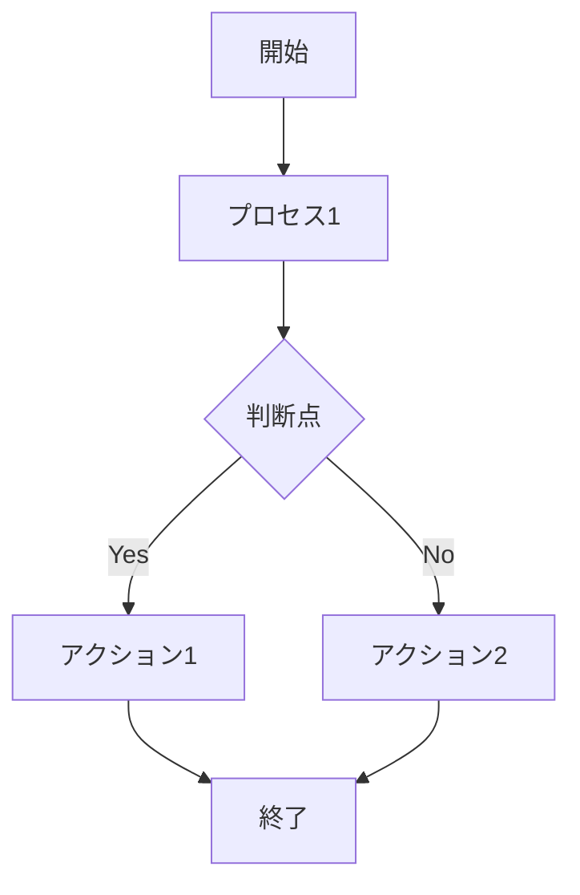
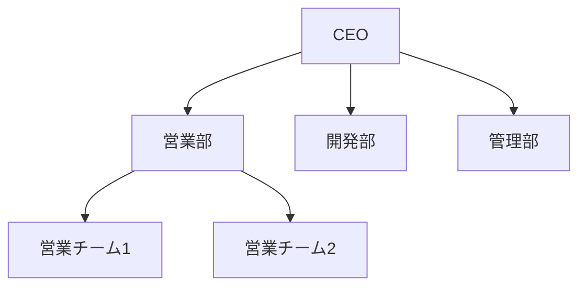
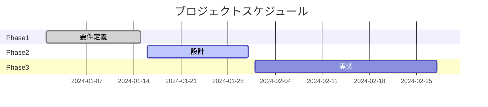
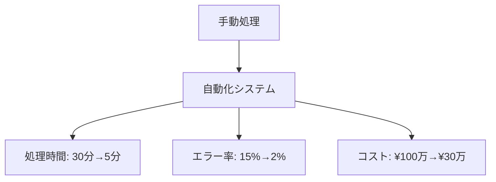

# CLAUDE.md - Phase 3: コンテキスト作成

## 🎯 フェーズ概要

**フェーズ名**: コンテキスト作成
**目的**: 設計されたコンセプトを基に、実際のプレゼンテーションコンテンツをMarkdownで作成する
**想定時間**: 45分-1時間
**成果物**: presentation-context.md, speaker-notes.md

## 📝 コンテンツ作成要件

### Phase 2からの引き継ぎ情報

**確定した設計要素**:
- **ストーリーライン**: [Phase 2で決定された構成]
- **核心メッセージ**: [最重要の伝えたいこと]
- **時間配分**: [各セクションの時間割り当て]
- **ビジュアル方針**: [図表・デザインの基本方針]

### Markdownコンテンツ構造

**ファイル構成**:
```
presentation-context.md     # メインプレゼンテーション内容
speaker-notes.md    # 発表者用ノート・補足情報
assets/            # 画像・データファイル
references/        # 参考資料・データソース
```

## ✍️ コンテンツ作成プロセス

### Step 1: メインコンテンツ作成

**presentation-context.mdの構造**:

```markdown
# [プレゼンテーションタイトル]

## スライド 1: タイトルスライド
- タイトル
- 発表者情報
- 日付・場所

## スライド 2-X: [各セクション]
- メインメッセージ
- 支持情報・データ
- ビジュアル要素（図表・画像）
- トランジション（次への繋ぎ）

## スライド Y: まとめ・アクション
- 核心メッセージの再確認
- 具体的なアクション要求
- 連絡先・フォローアップ情報
```

### Step 2: 発表者ノート作成

**speaker-notes.mdの内容**:

```markdown
# 発表者ノート

## 全体の流れ
- 発表時間: XX分
- 質疑応答: XX分
- 重要なタイミング

## スライド別詳細ノート
### スライド X: [タイトル]
- **話すべき内容**: [詳細な説明文]
- **所要時間**: X分
- **重要ポイント**: [絶対に伝えるべきこと]
- **想定質問**: [このスライドで予想される質問]
- **トランジション**: [次のスライドへの繋ぎ方]

## トラブル対応
- 時間が押した場合: [省略可能なスライド]
- 質問が長引いた場合: [時間調整方法]
- 技術的問題が発生した場合: [代替手段]
```

## 🎨 ビジュアル要素の実装

### Mermaid図表の作成

**使用場面と種類**:

#### フローチャート


#### 組織図・関係図


#### ガントチャート（スケジュール）


### Chart.js データ可視化

**データグラフの種類**:
- **棒グラフ**: 比較データ・カテゴリ別数値
- **折れ線グラフ**: 時系列データ・トレンド
- **円グラフ**: 割合・構成比
- **散布図**: 相関関係・分布

### 数式の表現

**MathJax数学式**:
```latex
$$E = mc^2$$

$$\sum_{i=1}^{n} x_i = x_1 + x_2 + \cdots + x_n$$

$$\frac{d}{dx}f(x) = \lim_{h \to 0} \frac{f(x+h) - f(x)}{h}$$
```

**mhchem化学式**:
```latex
$$\ce{H2O}$$
$$\ce{CaCO3 + 2HCl -> CaCl2 + H2O + CO2}$$
$$\ce{CH4 + 2O2 -> CO2 + 2H2O}$$
```

## 📊 表組み・データ表現

### 比較表の作成

```markdown
| 項目 | 現状 | 提案 | 改善効果 |
|:---:|:---:|:---:|:---:|
| 処理時間 | 30分 | 5分 | 83%短縮 |
| コスト | ¥100万 | ¥30万 | 70%削減 |
| 精度 | 85% | 98% | 13%向上 |
```

### データ表の表現

```markdown
| 地域 | Q1売上 | Q2売上 | 成長率 |
|:---:|:---:|:---:|:---:|
| 関東 | ¥500万 | ¥650万 | +30% |
| 関西 | ¥300万 | ¥360万 | +20% |
| 九州 | ¥200万 | ¥280万 | +40% |
```

## 🗣️ Claude Code協働方針

### このフェーズでClaude Codeに期待すること

1. **コンテンツの充実化**
   - 各スライドの内容の深掘り
   - 不足している情報の指摘
   - より説得力のある表現への改善

2. **文章品質の向上**
   - わかりやすい表現への修正
   - 聴衆レベルに適した言葉遣い
   - 論理的な文章構成の確認

3. **ビジュアル要素の最適化**
   - 効果的な図表の種類選択
   - データの見せ方の改善
   - 視覚的インパクトの強化

### 積極的に相談したいポイント

- [ ] 「この説明でわかりやすいか？」
- [ ] 「もっと説得力のあるデータ表現は？」
- [ ] 「この図表で伝わるか？」
- [ ] 「文章が長すぎないか？」
- [ ] 「聴衆の関心を引く表現になっているか？」

## 🎯 コンテンツ品質基準

### テキスト品質の確認

**明確性**:
- [ ] 各スライドのメッセージが一目瞭然
- [ ] 専門用語に適切な説明がある
- [ ] 聴衆のレベルに適した表現

**説得力**:
- [ ] データ・根拠が十分に示されている
- [ ] 論理的な流れが保たれている
- [ ] 感情に訴える要素がある

**実用性**:
- [ ] 発表者が話しやすい内容
- [ ] 時間内に収まる分量
- [ ] アクションが具体的

### ビジュアル品質の確認

**効果性**:
- [ ] 図表がメッセージを強化している
- [ ] 数値が視覚的にわかりやすい
- [ ] 色使いが適切

**技術的品質**:
- [ ] Mermaid図表が正しく表示される
- [ ] 数式が正確に記述されている
- [ ] 表組みが整理されている

## 📚 コンテンツパターン事例

### パターン1: データ重視型

```markdown
## 市場分析結果

### 現状分析
当市場の成長率は年間15%を記録しています。

| 年度 | 市場規模 | 成長率 |
|:---:|:---:|:---:|
| 2022 | ¥1,000億 | - |
| 2023 | ¥1,150億 | +15% |
| 2024予測 | ¥1,323億 | +15% |

### トレンド分析

```

### パターン2: 問題解決型

```markdown
## 課題と解決策

### 現状の問題点
- **問題1**: 処理時間が長い（現在30分）
- **問題2**: エラー率が高い（現在15%）
- **問題3**: コストが膨大（月間¥100万）

### 提案する解決策
システム自動化により以下を実現：



### 期待される効果
- **時間短縮**: 83%の効率化
- **品質向上**: エラー87%減少  
- **コスト削減**: 70%のコストカット
```

## ✅ コンテキスト作成完了チェックリスト

### Claude Codeとの協働確認
- [ ] 各スライドの内容充実度確認完了
- [ ] 文章の明確性・説得力確認完了
- [ ] ビジュアル要素の効果性確認完了
- [ ] 全体の一貫性・流れ確認完了

### 人間による最終確認
- [ ] 企業の方針・価値観との整合性確認
- [ ] 発表者の個性・話し方との適合性確認
- [ ] 機密情報・コンプライアンス最終チェック
- [ ] 発表時間の実測・調整

### アウトプット確認
- [ ] presentation-context.md作成完了
- [ ] speaker-notes.md作成完了
- [ ] 必要な図表・データ準備完了
- [ ] CLAUDE.md（本ファイル）更新完了
- [ ] Gitコミット完了

## 🚀 次フェーズへの申し送り

### Phase 4（ビジュアル開発）への重要事項
- **図表要素リスト**: [作成が必要な図表の一覧]
- **デザイン要件**: [色使い・フォント・レイアウト方針]
- **重要度優先順位**: [どの図表が最も重要か]

### コンテンツの特記事項
- **技術的配慮**: [特別な実装が必要な要素]
- **時間的制約**: [特に時間をかけるべき部分]
- **発表者への注意**: [特に練習が必要な箇所]

---

**📝 記入のコツ**:
- 発表者が話しやすい自然な文章にする
- データは視覚的にわかりやすく整理する
- スライド1枚につき1つのメッセージに絞る

**🤖 Claude Codeへの指示**:
このフェーズでは、内容の充実度と明確性を重視してください。聴衆が理解しやすく、発表者が話しやすいコンテンツになるよう、文章・データ表現・図表の改善提案を積極的に行ってください。