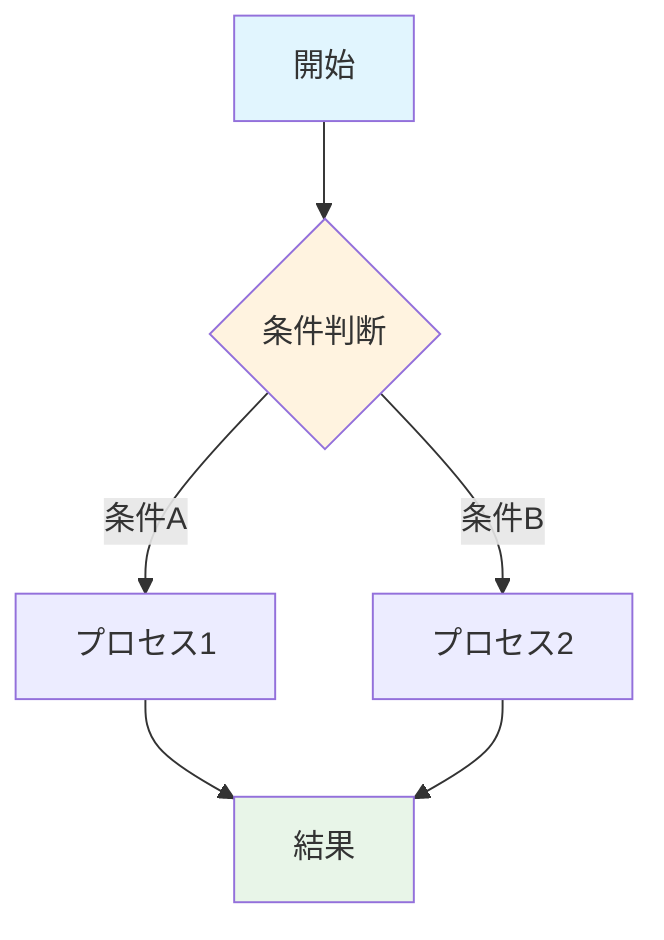
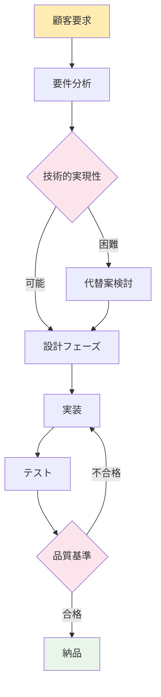
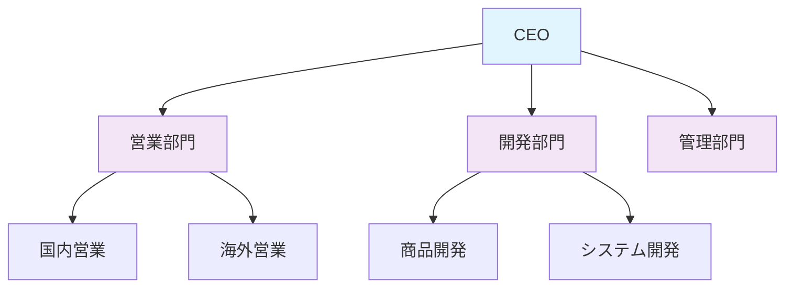
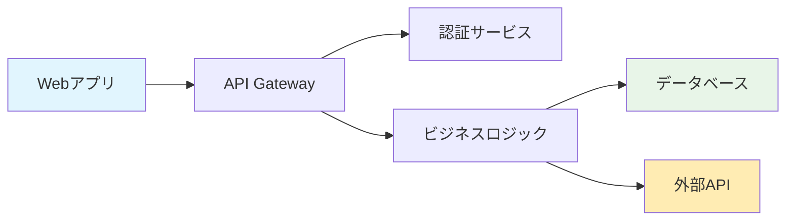
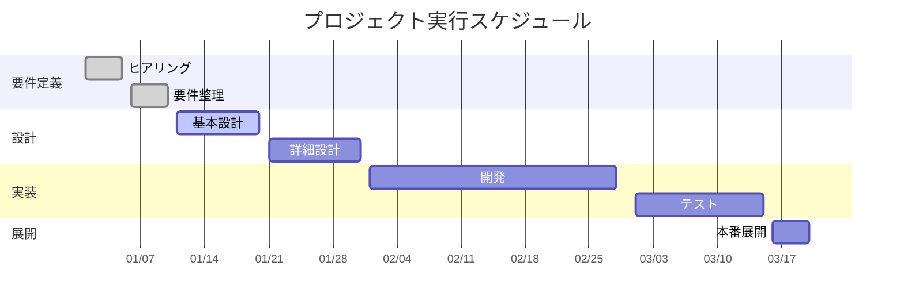
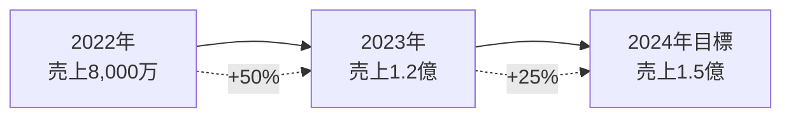
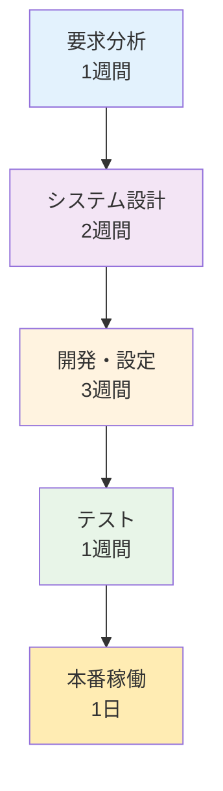

# CLAUDE.md - Phase 4: ビジュアル開発

## 🎯 フェーズ概要

**フェーズ名**: ビジュアル開発
**目的**: Markdownコンテンツの図表・数式・ビジュアル要素を実装・最適化する
**想定時間**: 30-60分
**成果物**: 完成したビジュアル要素、最適化されたpresentation-context.md

## 🎨 ビジュアル開発要件

### Phase 3からの引き継ぎ情報

**コンテンツベース**:
- **presentation-context.md**: [作成済みのメインコンテンツ]
- **図表要素リスト**: [実装が必要な図表の一覧]
- **デザイン要件**: [色使い・フォント・レイアウト方針]
- **重要度優先順位**: [どの図表が最も重要か]

### ビジュアル要素の分類

**実装対象の整理**:
- [ ] **Mermaid図表**: フローチャート、組織図、ガントチャート
- [ ] **Chart.js**: 棒グラフ、折れ線グラフ、円グラフ、散布図
- [ ] **数式**: MathJax数学式、mhchem化学式
- [ ] **表組み**: 比較表、データ表、スペック表
- [ ] **レイアウト**: スライド構成、視覚的階層

## 🔧 ビジュアル実装プロセス

### Step 1: Mermaid図表の実装

#### フローチャート最適化

**基本パターン**:


**複雑なビジネスプロセス**:


#### 組織図・関係図

**シンプルな組織構造**:


**システム関係図**:


#### ガントチャート（プロジェクトスケジュール）

**プロジェクト管理**:


### Step 2: Chart.js データ可視化

#### 売上データの可視化

**月次売上推移（折れ線グラフ）**:
```html
<canvas id="salesChart" width="400" height="200"></canvas>
<script>
const ctx = document.getElementById('salesChart').getContext('2d');
const salesChart = new Chart(ctx, {
    type: 'line',
    data: {
        labels: ['1月', '2月', '3月', '4月', '5月', '6月'],
        datasets: [{
            label: '売上（万円）',
            data: [120, 150, 180, 220, 250, 300],
            borderColor: '#1976d2',
            backgroundColor: 'rgba(25, 118, 210, 0.1)',
            tension: 0.4
        }]
    },
    options: {
        responsive: true,
        plugins: {
            title: {
                display: true,
                text: '月次売上推移'
            }
        }
    }
});
</script>
```

**商品別シェア（円グラフ）**:
```html
<canvas id="shareChart" width="300" height="300"></canvas>
<script>
const shareCtx = document.getElementById('shareChart').getContext('2d');
const shareChart = new Chart(shareCtx, {
    type: 'pie',
    data: {
        labels: ['商品A', '商品B', '商品C', '商品D'],
        datasets: [{
            data: [35, 25, 25, 15],
            backgroundColor: [
                '#1976d2',
                '#388e3c',
                '#f57c00',
                '#d32f2f'
            ]
        }]
    },
    options: {
        responsive: true,
        plugins: {
            title: {
                display: true,
                text: '商品別売上シェア'
            }
        }
    }
});
</script>
```

### Step 3: 数式の実装

#### MathJax数学式

**基本的な数式**:
```latex
$$ROI = \frac{利益 - 投資額}{投資額} \times 100\%$$

$$成長率 = \frac{今年の売上 - 昨年の売上}{昨年の売上} \times 100\%$$

$$平均値 = \frac{\sum_{i=1}^{n} x_i}{n}$$
```

**複雑な財務計算**:
```latex
$$NPV = \sum_{t=0}^{n} \frac{CF_t}{(1+r)^t}$$

$$IRR: \sum_{t=0}^{n} \frac{CF_t}{(1+IRR)^t} = 0$$

$$WACC = \frac{E}{V} \times R_e + \frac{D}{V} \times R_d \times (1-T)$$
```

#### mhchem化学式

**化学反応式**:
```latex
$$\ce{2H2 + O2 -> 2H2O}$$

$$\ce{CaCO3 + 2HCl -> CaCl2 + H2O + CO2}$$

$$\ce{CH4 + 2O2 -> CO2 + 2H2O + \text{エネルギー}}$$
```

### Step 4: 表組みの最適化

#### 比較表の高度化

**競合比較表**:
```markdown
| 項目 | 自社製品 | 競合A | 競合B | 差別化ポイント |
|:---:|:---:|:---:|:---:|:---:|
| **価格** | ¥100万 | ¥150万 | ¥120万 | ✅ 最安値 |
| **性能** | 100% | 85% | 90% | ✅ 最高性能 |
| **サポート** | 24時間 | 営業時間 | 営業時間 | ✅ 24時間対応 |
| **導入期間** | 1週間 | 4週間 | 2週間 | ✅ 最短導入 |
| **総合評価** | ⭐⭐⭐⭐⭐ | ⭐⭐⭐ | ⭐⭐⭐⭐ | 🏆 総合1位 |
```

**ROI分析表**:
```markdown
| 年度 | 投資額 | 削減コスト | 累積効果 | ROI |
|:---:|:---:|:---:|:---:|:---:|
| **Year 1** | ¥500万 | ¥200万 | ¥200万 | -60% |
| **Year 2** | ¥0万 | ¥300万 | ¥500万 | 0% |
| **Year 3** | ¥0万 | ¥300万 | ¥800万 | +60% |
| **Year 4** | ¥0万 | ¥300万 | ¥1,100万 | +120% |
| **Year 5** | ¥0万 | ¥300万 | ¥1,400万 | +180% |
```

## 🗣️ Claude Code協働方針

### このフェーズでClaude Codeに期待すること

1. **図表の効果性チェック**
   - データが視覚的にわかりやすいか
   - メッセージが図表で強化されているか
   - 色使い・デザインが適切か

2. **技術的品質の確保**
   - Mermaid図表の構文が正確か
   - 数式が正しく表記されているか
   - 表組みが整理されているか

3. **視覚的インパクトの最大化**
   - より印象的な表現方法の提案
   - データの見せ方の改善
   - 聴衆の注意を引く工夫

### 積極的に相談したいポイント

- [ ] 「この図表でデータが伝わるか？」
- [ ] 「もっとインパクトのある表現方法は？」
- [ ] 「色使いは適切か？」
- [ ] 「数式は正確に記述されているか？」
- [ ] 「表組みは見やすいか？」

## 🎨 デザイン品質基準

### 視覚的品質

**明確性**:
- [ ] 一目で内容が理解できる
- [ ] 重要な情報が際立っている
- [ ] 聴衆の視線の流れが計算されている

**美しさ**:
- [ ] 色調が統一されている
- [ ] レイアウトがバランス良い
- [ ] プロフェッショナルな仕上がり

**効果性**:
- [ ] メッセージを強化している
- [ ] 聴衆の感情に訴えている
- [ ] 記憶に残りやすい

### 技術的品質

**正確性**:
- [ ] データが正確に表現されている
- [ ] 数式・化学式が正しい
- [ ] 図表の構文エラーがない

**互換性**:
- [ ] ブラウザで正しく表示される
- [ ] モバイルデバイスでも見やすい
- [ ] 印刷時も適切に表示される

## 🎯 ビジュアルパターン事例

### パターン1: データドリブン型

**KPI ダッシュボード風**:
```markdown
## 業績サマリー

### 📊 主要指標
| KPI | 現在値 | 目標値 | 達成率 |
|:---:|:---:|:---:|:---:|
| **売上** | ¥1.2億 | ¥1.5億 | 80% 📈 |
| **利益率** | 15% | 20% | 75% 📊 |
| **顧客満足度** | 4.2/5.0 | 4.5/5.0 | 93% ⭐ |

### 📈 成長トレンド

```

### パターン2: プロセス説明型

**ワークフロー可視化**:
```markdown
## システム導入フロー

### 🔄 全体プロセス


### ⏰ スケジュール詳細
| フェーズ | 期間 | 担当 | 成果物 |
|:---:|:---:|:---:|:---:|
| 要求分析 | 1週間 | コンサル | 要件定義書 |
| システム設計 | 2週間 | SE | 設計書 |
| 開発・設定 | 3週間 | 開発チーム | システム |
| テスト | 1週間 | QA | テスト報告書 |
| 本番稼働 | 1日 | 全員 | 稼働システム |
```

## ✅ ビジュアル開発完了チェックリスト

### Claude Codeとの協働確認
- [ ] 全図表の効果性・明確性確認完了
- [ ] 技術的品質（構文・表示）確認完了
- [ ] 視覚的インパクト最大化確認完了
- [ ] 全体の一貫性・統一性確認完了

### 人間による最終確認
- [ ] ブランドガイドラインとの整合性確認
- [ ] 視覚的な好み・企業文化との適合性確認
- [ ] 発表環境（プロジェクター等）での見え方確認
- [ ] 印刷時の視認性確認

### 技術的動作確認
- [ ] Mermaid図表の表示確認
- [ ] Chart.jsグラフの動作確認
- [ ] 数式の正確な表示確認
- [ ] 表組みのレイアウト確認
- [ ] レスポンシブデザイン確認

## 🚀 次フェーズへの申し送り

### Phase 5（HTML生成）への重要事項
- **完成ビジュアル要素**: [実装済みの全図表・数式一覧]
- **技術的要件**: [Chart.js設定、MathJax設定等]
- **スタイル要件**: [色設定、フォント、レイアウト]

### 特別な実装要件
- **カスタムCSS**: [特別なスタイリングが必要な要素]
- **JavaScript**: [インタラクティブ要素の設定]
- **外部リソース**: [必要なライブラリ・フォント]

---

**📝 記入のコツ**:
- 図表は「一目でわかる」を最優先にする
- 色使いは企業ブランドと統一する
- データの信頼性を最重視する

**🤖 Claude Codeへの指示**:
このフェーズでは、視覚的効果と技術的品質の両立を重視してください。図表がメッセージを強化し、聴衆に強い印象を与えるよう、デザイン・データ表現の改善提案を積極的に行ってください。